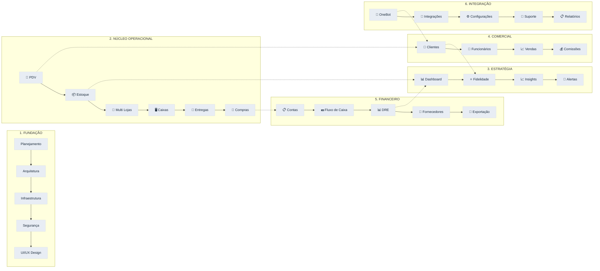
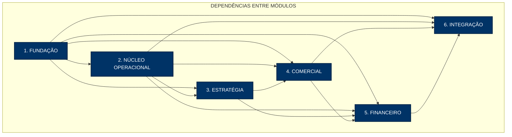
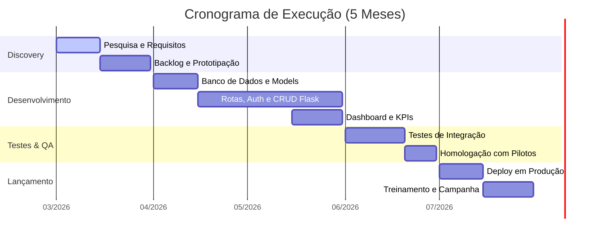
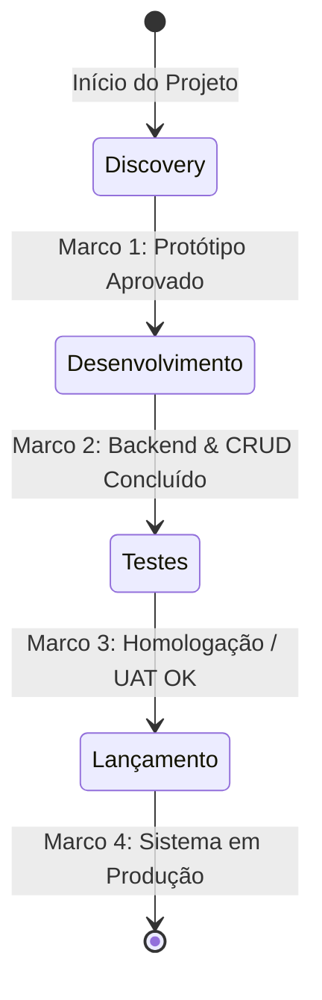
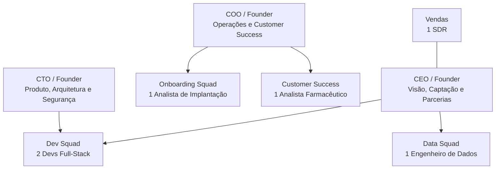

# 📊 PharmaConekt - Plano de Gerência e Engenharia de Software

Este documento detalha o planejamento estratégico, o escopo do MVP e a modelagem arquitetural da plataforma SaaS **PharmaConekt**.

---

## 1. INTRODUÇÃO

O PharmaConekt evoluiu de um simples integrador de estoques para um ecossistema completo de gestão farmacêutica, transformando dados em decisões lucrativas para farmácias independentes e micro-redes na região metropolitana de Belém. O sistema unifica operações (PDV, estoque, caixas, entregas e multi lojas), gestão comercial (clientes, financeiro, vendas, comissões e insights) e estratégia (dashboard, fidelidade, alertas, relatórios e OneBot), eliminando ilhas de informação e capacitando o gestor a competir com as grandes redes. O objetivo principal é reduzir perdas por vencimento e ruptura em até 40%, enquanto aumenta o faturamento com inteligência de dados, sugestões contextualizadas de venda e otimização de preços baseada em análise de mercado.

Visão do Produto: "Para farmácias independentes e micro-redes que buscam crescer lucrativamente em um mercado competitivo, o PharmaConekt é um ecossistema SaaS que integra operações, finanças e estratégia, transformando dados em decisões lucrativas e reduzindo perdas em até 40%."

Missão do MVP: Entregar uma plataforma web funcional e intuitiva, com persistência de dados em nuvem, capaz de gerenciar o onboarding, as métricas táticas de faturamento, o programa de fidelidade, os insights de mercado e os alertas inteligentes de forma ágil, centralizada e com dados sincronizados em menos de 5 segundos.

---

## 2. ESTRUTURA ANALÍTICA DO PROJETO (EAP)

A decomposição hierárquica do trabalho para a construção completa do ecossistema:

```mermaid
graph TD
    A[🏥 PharmaConekt<br/>Ecossistema Completo] --> B[1. FUNDAÇÃO DO SISTEMA]
    A --> C[2. NÚCLEO OPERACIONAL]
    A --> D[3. ESTRATÉGIA & CRESCIMENTO]
    A --> E[4. COMERCIAL & CLIENTES]
    A --> F[5. FINANCEIRO]
    A --> G[6. INTEGRAÇÃO & SUPORTE]

    B --> B1[Planejamento]
    B --> B2[Arquitetura]
    B --> B3[Infraestrutura]
    B --> B4[Segurança]
    B --> B5[UI/UX Design]

    C --> C1[🛒 PDV]
    C --> C2[📦 Estoque]
    C --> C3[🏢 Multi Lojas]
    C --> C4[🖥️ Caixas]
    C --> C5[🛵 Entregas]
    C --> C6[🛒 Compras]

    D --> D1[📊 Dashboard]
    D --> D2[⭐ Fidelidade]
    D --> D3[📈 Insights]
    D --> D4[🔔 Alertas]

    E --> E1[👤 Clientes]
    E --> E2[👔 Funcionários]
    E --> E3[📈 Vendas]
    E --> E4[💰 Comissões]

    F --> F1[📋 Contas]
    F --> F2[💵 Fluxo de Caixa]
    F --> F3[📊 DRE]
    F --> F4[🏢 Fornecedores]
    F --> F5[📄 Exportação]

    G --> G1[🤖 OneBot]
    G --> G2[🔗 Integrações]
    G --> G3[⚙️ Configurações]
    G --> G4[💬 Suporte]
    G --> G5[📋 Relatórios]

    classDef raiz fill:#003366,color:#fff,stroke:#002244,stroke-width:2px,font-size:16px
    classDef nivel1 fill:#1a4f7a,color:#fff,stroke:#002244,stroke-width:2px
    classDef nivel2 fill:#e8edf4,color:#1a2a3a,stroke:#d5dde8,stroke-width:1px

    class A raiz
    class B,C,D,E,F,G nivel1
    class B1,B2,B3,B4,B5,C1,C2,C3,C4,C5,C6,D1,D2,D3,D4,E1,E2,E3,E4,F1,F2,F3,F4,F5,G1,G2,G3,G4,G5 nivel2
```



## 2.1 VERSÃO INTERATIVA POR MÓDULO


## 2.2 MATRIZ DE DEPENDÊNCIAS



## 3. CRONOGRAMA MACRO (GRÁFICO DE GANTT)

O cronograma de execução está planejado para uma janela de 5 meses (20 semanas):



## 4. DIAGRAMA DE FASES DO PROJETO

Ciclo de vida do projeto orientado por portões de decisão e marcos técnicos:


## 5. DIAGRAMA DE CASOS DE USO

Interações de atores externos e usuários com as funcionalidades previstas no escopo do MVP:

```mermaid
graph LR
    admin[Administrador Master] --- uc1(Fazer Login)
    admin --- uc2(Cadastrar Loja)
    admin --- uc3(Listar Lojas)

    dono[Dono de Farmácia] --- uc1
    dono --- uc4(Ver Dashboard de KPIs)

    cs[Operador de Onboarding] --- uc1
    cs --- uc5(Consultar Integração)
    cs --- uc6(Atualizar Status da Loja)

    pdv[Sistema de PDV Externo] --- uc7(Importar Dados de Vendas)

   ```

## 6. DIAGRAMA DE CLASSES

Estrutura das tabelas de dados gerenciadas pelas models do Flask:
```mermaid
classDiagram
    class Usuario {
        +int id
        +String nome
        +String username
        +String password_hash
        +fazer_login()
    }
    class Loja {
        +int id
        +String nome
        +String cnpj
        +String pdv_sistema
        +String status_onboarding
        +int sugestoes_aceitas
        +int alertas_vencimento
        +cadastrar()
        +editar()
        +excluir()
    }

    Usuario "1" --> "0..*" Loja : Gerencia/Monitora
```

## 7. COMPOSIÇÃO DA EQUIPE (SQUADS FUNCIONAIS)
Nos primeiros 12 meses, a empresa adota um modelo de squads funcionais enxutos, com hierarquia plana, comunicação direta e regime de trabalho remoto-assíncrono. O escritório físico compartilhado localiza-se nos bairros do Marco ou Batista Campos, em Belém.A equipe é composta por 9 integrantes, divididos da seguinte forma:



Liderança Executiva:

    CEO / Founder: Responsável pela visão de negócio, captação de recursos e parcerias com distribuidoras regionais e o Sindicato dos Farmacêuticos do Pará (Sinfarpa).
    CTO / Founder: Lidera o produto, segurança e garante latência mínima de 5 segundos para a união instantânea de dados.

    COO / Founder: Gerencia as operações, focado no onboarding e retenção.

Estrutura dos Squads:
    Dev Squad (2 Devs Full-Stack): Um focado em backend/integrações e outro em frontend/dashboards.

    Data Squad (1 Engenheiro de Dados): Responsável pelos fluxos de dados e algoritmos de previsão de demanda (média móvel e ajuste sazonal).

    Onboarding Squad (1 Analista de Implantação): Realiza a carga inicial de dados (Top 200 SKUs), configuração e treinamento remoto de 30 minutos.

    Customer Success (1 Analista Farmacêutico): Fornece suporte especializado em regras da Anvisa, controle de lotes e receitas.

    Vendas (1 SDR): Prospecção activa via WhatsApp e visitas físicas em Belém.
```
```
## 8. MODELO DE PRECIFICAÇÃO E RECEITA

O modelo comercial foi estruturado especificamente para o formato SaaS (Software as a Service) B2B, focado na recorrência.
8.1. Estrutura de Receita (Assinatura Mensal)

    Plano Loja Individual: R$ 199,00 por mês.

    Plano Rede (Até 5 lojas integradas): R$ 399,00 por mês.

8.2. Investimento do MVP (Preço Fixo)

Para a construção, validação e estabilização do barramento Flask com banco SQLite que você possui no código, o valor comercial fechado do projeto está estipulado em R$ 120.000,00, com pagamentos atrelados aos seguintes marcos técnicos:

    30% na Entrada: Homologação dos protótipos de tela.

    30% na Entrega Intermediária: Banco de dados SQLite estruturado e rotas de CRUD operacionais.

    40% no Encerramento: Liberação do Dashboard com métricas e homologação concluída.

## 9. METODOLOGIA OKR E KPIs SEMANAIS

Alinhado aos objetivos estratégicos do negócio, a gestão monitora o desempenho através de metas anuais e indicadores semanais.
9.1. OKR Anual (Foco em Validação e Tração)

    Objetivo Estratégico: Validar o modelo de negócio e atingir tração inicial no mercado paraense de farmácias independentes, demonstrando prontidão para uma rodada de captação seed.

        KR1 (Aquisição): Fechar 30 farmácias pagantes até o mês 12, gerando um MRR (Faturamento Recorrente Mensal) de R$ 5.970,00.

        KR2 (Eficiência): Reduzir o tempo de onboarding para menos de 3 dias úteis (mediana) até o mês 9.

        KR3 (Satisfação): Alcançar Net Promoter Score (NPS) >= 50 entre os clientes ativos no mês 12.

9.2. KPIs Semanais (Métricas Táticas Operacionais)

Diferente dos KRs (que medem resultados de longo prazo), os KPIs são acompanhados semanalmente para ajustes rápidos de rota:

    Farmácias em Demonstração: Meta de >= 3 apresentações realizadas por semana (Dono: SDR).

    Tempo de Ativação: Meta de mediana < 36 hours para o cliente completar as primeiras configurações (Dono: Onboarding Squad).

    Churn Semanal: Meta de < 2% de cancelamentos na semana (Dono: Customer Success).

    Taxa de Aceitação de Sugestões: Meta de > 60% das sugestões automáticas aplicadas pelo cliente (Dono: Data Squad).

    Crescimento Líquido de Clientes Ativos: Ganho de 1 a 2 novas farmácias integradas por semana (Dono: CEO).

## 10. PROCESSO CRÍTICO E CRITÉRIOS DE ACEITE (HOMOLOGAÇÃO)
10.1. O Fluxo de Onboarding (5 a 7 dias úteis)

O onboarding é o processo crítico porque dita a retenção do cliente no ecossistema SaaS. O fluxo funciona assim:

    Prospecção & Demo: SDR qualifica a farmácia e os fundadores realizam a disposição.

    Assinatura & Coleta: Coleta da versão do PDV, lista de distribuidores e catálogo dos Top 200 SKUs.

    Configuração Técnico (Em até 48h): Importação de lotes, estoques e datas de validade pelo Onboarding Squad.

    Treinamento & Ativação: Treinamento remoto de 30 minutos. O cliente é considerado "Ativado" quando aceita pelo menos 3 sugestões de compra consecutivas e resolve seu primeiro alerta de vencimento em tela.

10.2. Critérios de Aceite para Entrega do Software

O projeto de software será dado como concluído e aceito quando cumprir os seguintes requisitos práticos verificáveis no código:

    Ciclo de Vida das Lojas (CRUD): O administrador consegue cadastrar novas lojas, listar, editar dados de integração e atualizar o status sem falhas ou exceções no banco database.db (SQLite).

    Cálculo Automatizado de KPIs: O painel (Dashboard) exibe de forma clara e dinâmica as regras de MRR baseadas na quantidade de lojas ativas.

    Teste de Validação de Usuário (UAT): Execução com sucesso onde o usuário simula o fluxo completo (Login -> Visualização das Lojas -> Edição de Status de Onboarding) sem necessidade de suporte técnico do desenvolvedor.

