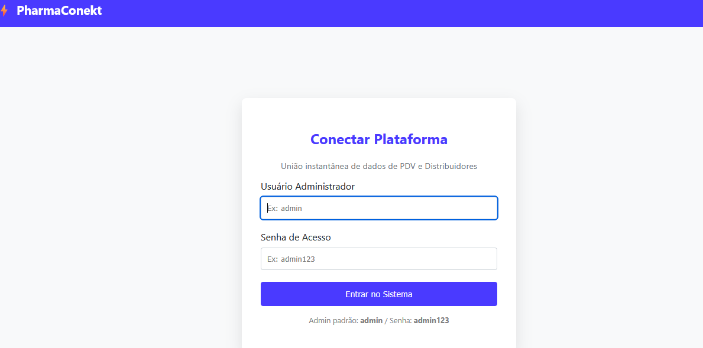
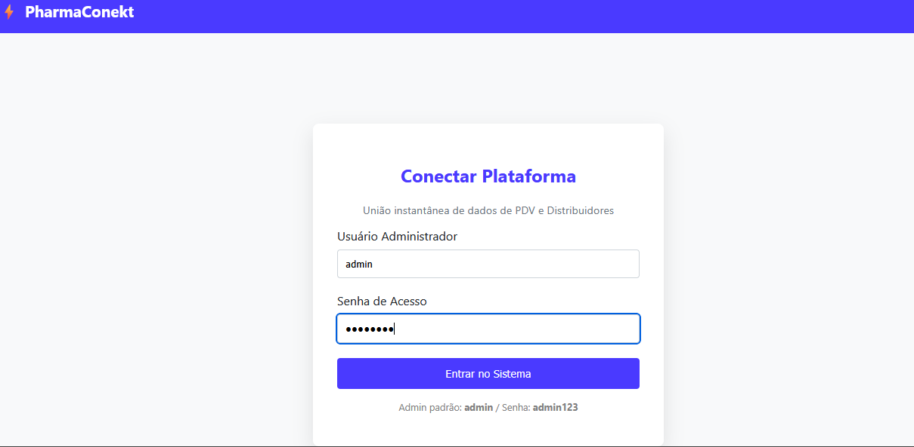
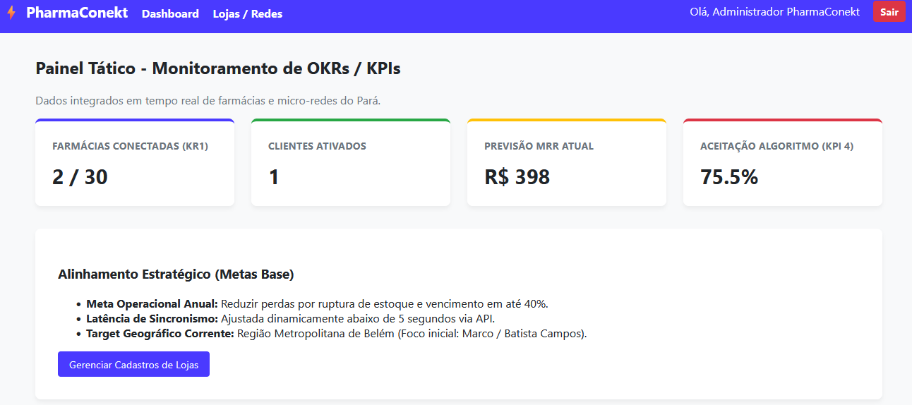
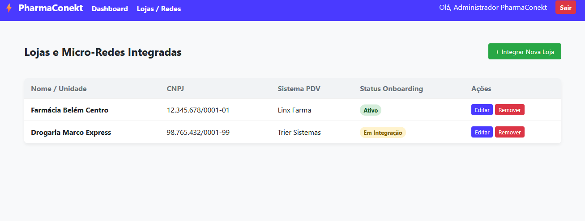
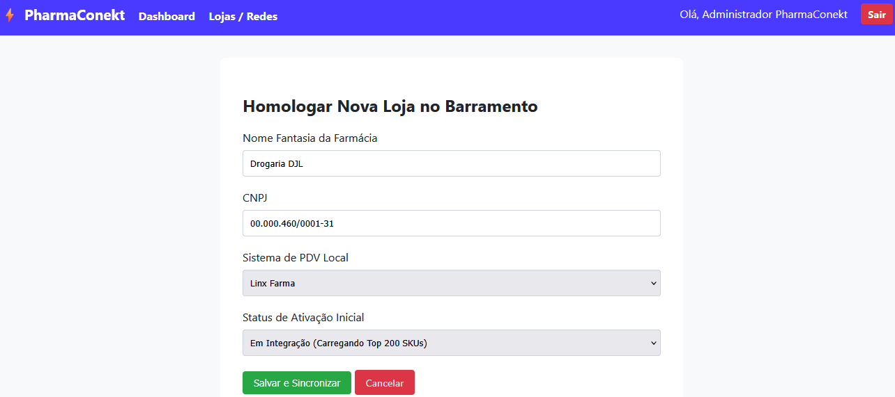
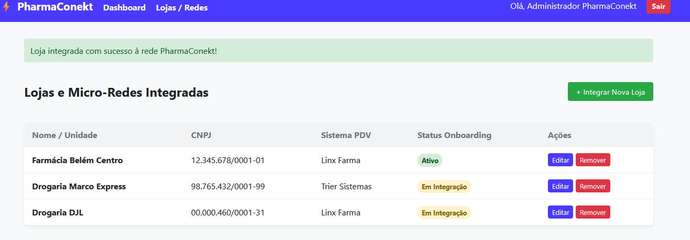

# PharmaConekt - Plataforma SaaS de Integração Farmacêutica

Este projeto consiste em um MVP funcional em Flask estruturado para resolver a fragmentação de dados em farmácias independentes e micro-redes.

## 🚀 Como Executar

1. Certifique-se de ter o Python instalado.
2. Instale as dependências executando:
   ```bash
   pip install -r requirements.txt

   ## 📸 Demonstração do Sistema

### 🔐 Tela de Login
Aqui o usuário insere suas credenciais de administrador para acessar o painel.



### 🔐 Tela de Login Realizado
Aqui o usuário já inseriu suas credenciais de administrador para acessar o painel.



### 📊 Painel Principal (Dashboard)
Após o acesso, o usuário visualiza o controle geral do PharmaConekt.


### 🔐 Tela Visualizando 
Visualização de redes Credenciadas.

### 🔐 Tela de Novo cadastro


### 🏪 Cadastro de Lojas e Micro-Redes
