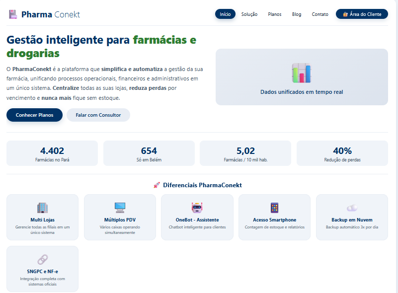
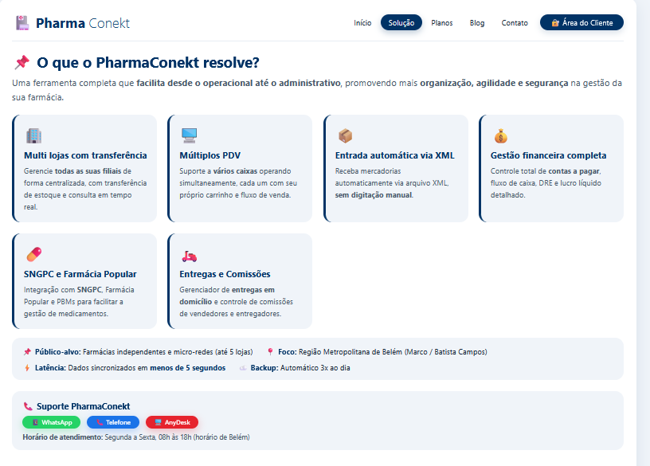

# 💊 PharmaConekt - Gestão Inteligente para Farmácias

O **PharmaConekt** é um sistema web moderno desenvolvido para otimizar e simplificar o gerenciamento operacional de farmácias. A plataforma une uma interface intuitiva a fluxos eficientes para controle de dados, facilitando a rotina de trabalho e melhorando a experiência do usuário final.

## 🚀 Tecnologias Utilizadas
* **HTML5** – Estruturação semântica da aplicação.
* **CSS3** – Design responsivo, moderno e estilização personalizada.
* **JavaScript (ES6+)** – Dinamismo, manipulação do DOM e comportamentos interativos.

---

## 📸 Demonstração Visual (Interface do Sistema)

Aqui você pode acompanhar as principais telas e o fluxo de funcionamento do sistema:

### 🖥️ Tela Principal / Dashboard
*Visão geral do sistema com acesso rápido às principais funcionalidades.*

### 🔐 Tela de Login / Autenticação
*Interface segura e intuitiva para controle de acesso dos operadores.*

### 📝 Módulo de Soluções
*Formulários dinâmicos e validados para inserção de novos registros no sistema.*

---

## 🔗 Link do Projeto em Produção

O deploy do projeto foi realizado através do GitHub Pages e pode ser acessado em tempo real:

🌐 [**Clique aqui para acessar o PharmaConekt online**](https://leidysts.github.io/PharmaConekt/)